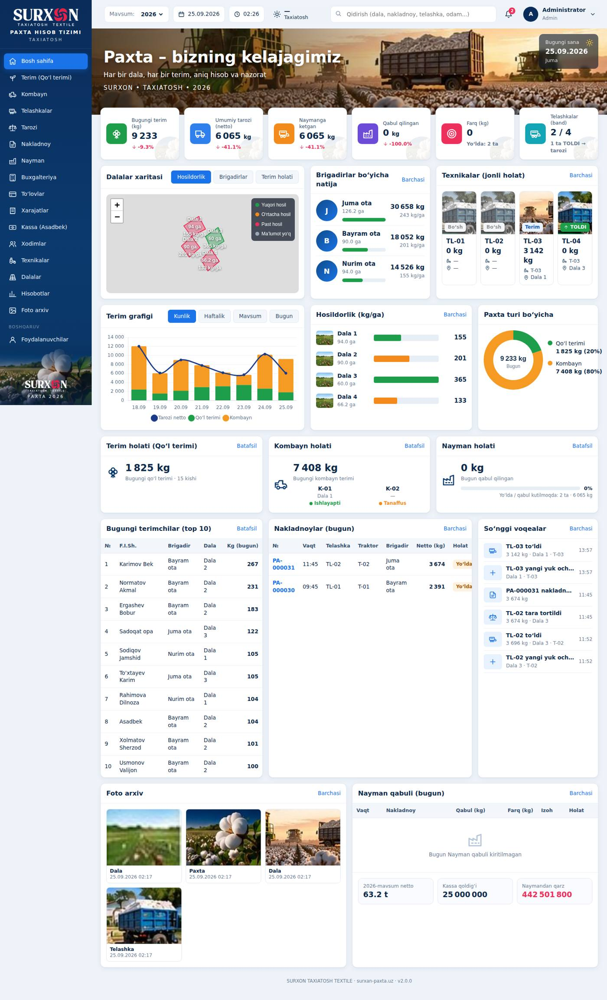
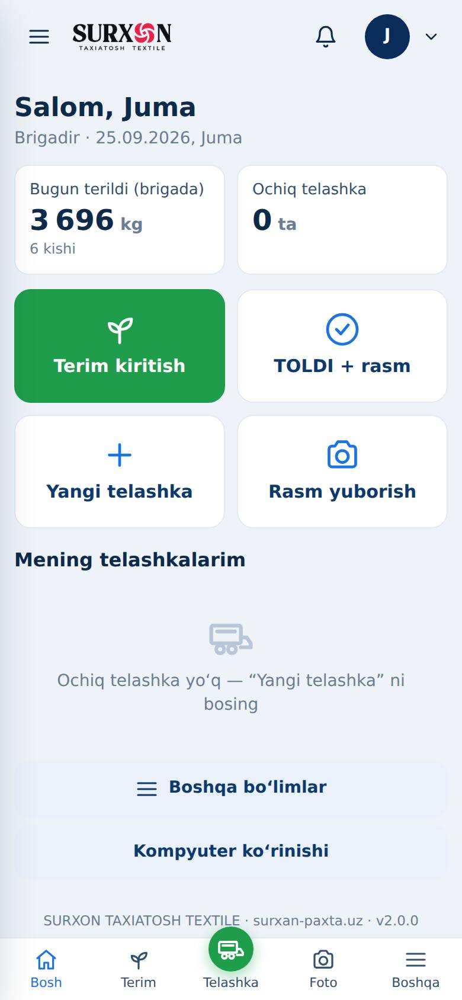
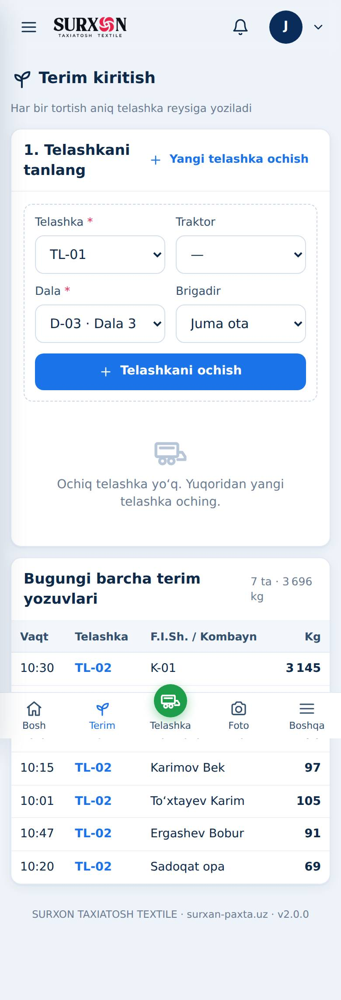
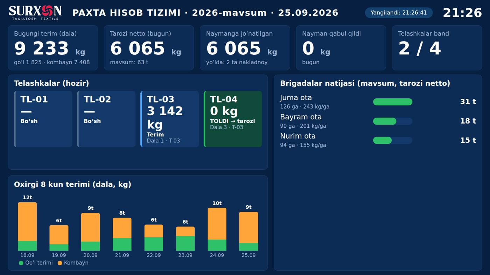

# SURXON PAXTA HISOB TIZIMI · surxan-paxta.uz

SURXON TAXIATOSH TEXTILE uchun paxta mavsumini to‘liq yuritish tizimi: dala → terim → telashka reysi → umumiy tarozi → nakladnoy → Nayman → to‘lov → ishchi haqi, avans, xarajat va kassa → hisobot.

Bitta backend va bitta baza bilan ishlaydi. Uning bir necha xil ko‘rinishi bor:

| Ko‘rinish | Kim uchun | Manzil |
|---|---|---|
| Kompyuter dashboardi | Rahbar, admin, buxgalter | `https://surxan-paxta.uz/` |
| Telefon (yengil, rolga mos) | Brigadir, tarozi, kassa va boshqalar | o‘sha manzil, telefonda avtomatik |
| Telegram bot | Dala va tarozi | bot orqali |
| TV ekran | Ofis / sex | `https://surxan-paxta.uz/tv` |
| Azizbek ERP (faqat o‘qish API) | Tashqi tizim | `/api/erp/v1/` |



| Telefon: brigadir | Telefon: terim | TV |
|---|---|---|
|  |  |  |

## Asosiy qoidalar

- **Kilogramm ikki marta hisoblanmaydi.** Uch o‘lchov alohida saqlanadi: dala tarozisi (ishchi/kombayn), umumiy tarozi netto (yakuniy) va Nayman qabuli. Har bir terim aniq telashka reysiga bog‘lanadi.
- **Nakladnoy raqami** (PA-000001…) tranzaksiya ichida beriladi, takrorlanmaydi.
- **Takroriy yozuv yo‘q.** Qayta bosish, internet uzilgach qayta yuborish yoki Telegram updateni qayta yetkazish bitta yozuv yaratadi.
- **Hech narsa o‘chirilmaydi.** Bekor qilish sabab bilan yoziladi. Audit tarixini o‘zgartirib bo‘lmaydi (kim, qachon, eski/yangi qiymat, sabab).
- **Pul taxmin qilinmaydi.** Narx, stavka yoki boshlang‘ich qoldiq kiritilmagan bo‘lsa, tegishli summa “hisoblanmagan” deb ko‘rsatiladi, 0 deb emas.
- **Rollar va brigada cheklovi** server tomonida tekshiriladi (web va Telegram uchun bir xil) — [docs/VAKOLATLAR.md](docs/VAKOLATLAR.md).
- **Ko‘p yillik arxiv.** Yopilgan mavsum qotiriladi. Keyingi yil gektar o‘zgarsa ham eski hisobot o‘zgarmaydi.
- **Oflayn.** Dalada internet uzilsa, yozuv telefonda saqlanadi va keyin avtomatik yuboriladi.

## Hujjatlar

- [Serverga o‘rnatish](docs/DEPLOYMENT.md)
- [Zaxira nusxa va tiklash, migratsiya](docs/TIKLASH.md)
- [Vakolatlar jadvali](docs/VAKOLATLAR.md)
- [Azizbek ERP API](docs/ERP_API.md)
- [Tekshiruv natijalari va tezlik o‘lchovi](docs/TEKSHIRUV.md)
- [Tasdiqlanishi kerak bo‘lgan biznes ma’lumotlari](docs/OCHIQ_MASALALAR.md)

## Texnik tuzilma

Python 3.11+ · Flask · SQLite (WAL) · gunicorn · Caddy (HTTPS) · Docker. Telefon uchun PWA va IndexedDB oflayn navbat.

```
app.py                 kirish nuqtasi (gunicorn app:app)
surxon/
  db.py                sxema, migratsiya, tranzaksiya
  security.py          rollar, vakolatlar, CSRF, audit
  services.py          biznes qoidalari (web va bot uchun umumiy)
  queries.py           dashboard va hisobot so‘rovlari
  telegram_bot.py      Telegram webhook bot
  photos.py            rasmni tekshirish, siqish, yopiq saqlash
  backup.py            zaxira nusxa
  views/               sahifalar, ERP API, TV
templates/  static/    dizayn
tests/                 31 ta avtomatik test
tools/                 skrinshot va tezlik o‘lchovi
```

```bash
pip install -r requirements-dev.txt
pytest -q
```
